# drawsvg Quick Reference

Repository: [https://github.com/cduck/drawSvg](https://github.com/cduck/drawSvg)


```
import drawsvg as dw
```

## Canvas and Document Structure
```
d = dw.Drawing(width, height, origin=(0, 0), 
               context: drawsvg.types.Context = None, animation_config=None, 
               id_prefix='d', **svg_args)
```

It is recommended to use a unique `id_prefix` for each svg on a webpage.

```python
d = dw.Drawing(400, 300, id_prefix='pic')
```


## Basic Shapes

### One Line

```
dw.Line(sx, sy, ex, ey, **kwargs)
```

```python
line = dw.Line(30,30,90,90,stroke='black')
d.append(line)
```
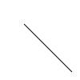


### Multiple Lines

This is SVG's `polyline`. 
(But drawsvg renders as path with multiple L.)

```
dw.Lines(sx, sy, *points, close=False, **kwargs)
```

```python
lines = dw.Lines(10,90,10,10,80,90,80,10,fill='none',stroke='black')
```
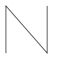


```python
x = [30+x*10 for x in range(20)]
y = [80,20]*10
xy = [item for sublist in zip(x,y) for item in sublist]
d.append(dw.Lines(*xy,stroke='black',stroke_width=5,fill='none'))
```
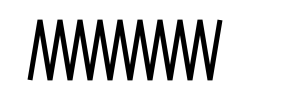


### Polygon

SVG `Polygon` is drawsvg `Lines` with `close=True`.

```python
polygon = dw.Lines(15,10,55,10,45,20,5,20,fill='red',stroke='black',close='true')
star = dw.Lines(48,16, 16,96, 96,48, 0,48, 88,96,
         stroke='black',fill='none',close='true')
```
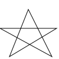


### Rectangle

```
dw.Rectangle(x, y, width, height, **kwargs)
```

```python
# black interior, no outline
d.append(dw.Rectangle(10,10,90,150))
# no interior, black outline
d.append(dw.Rectangle(120,10,60,120,fill='none',stroke='black'))
# blue interior, thick semi-transparent red outline
d.append(dw.Rectangle(210,10,75,90,fill='#0000ff',stroke='red',
                      stroke_width=7,stroke_opacity=0.5))
# semi-transparent yellow interior, dashed green outline
d.append(dw.Rectangle(300,10,105,60,fill='yellow',fill_opacity=0.5,
                      stroke='green',stroke_width=2,stroke_dasharray='5,2'))
```
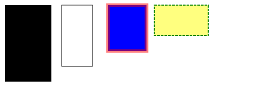


Rounded corners:

```python
# define both rx and ry
d.append(dw.Rectangle(10,10,80,180,rx='10',ry='10',stroke='black',fill='none'))
# if only one is given, it applies to both
d.append(dw.Rectangle(110,10,80,180,ry='20',stroke='black',fill='none'))
d.append(dw.Rectangle(210,10,80,180,rx='40',stroke='black',fill='none'))
# rx and ry unequal
d.append(dw.Rectangle(310,10,80,180,rx='30',ry='10',stroke='black',fill='none'))
d.append(dw.Rectangle(410,10,80,180,rx='10',ry='30',stroke='black',fill='none'))
```
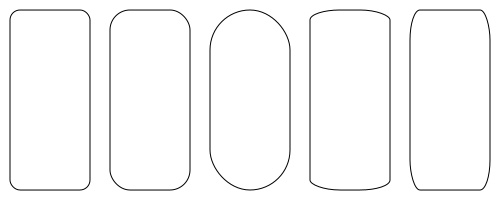


### Circle

```
dw.Circle(cx, cy, r, **kwargs)
```
cx and cy point to circle's center, r refer to its radius

```python
d.append(dw.Circle(50,50,40))
d.append(dw.Circle(150,50,40,stroke='black',fill='none'))
d.append(dw.Circle(250,50,40,stroke='black',fill='none',stroke_width=15))
```
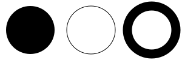


### Ellipse

```
dw.Ellipse(cx, cy, rx, ry, **kwarg)
```
(cx,cy) points to the center and (rx,ry) tells its radius

```python
d.append(dw.Ellipse(350,50,50,30))
d.append(dw.Ellipse(460,50,50,30,stroke='black',fill='none'))
d.append(dw.Ellipse(550,50,30,45,stroke='black',fill='none'))
```
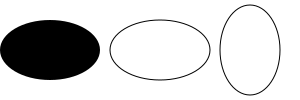


## Color and Painting Properties

For a full list, see [W3C specifications](https://www.w3.org/TR/SVG11/styling.html).


### fill and stroke_color

Possible color keyword names are: `aqua, black, blue, fuchsia, gray, green,
lime, maroon, navy, olive, purple, red, silver, teal, white`, and `yellow`.

Or #rrggbb, or #rgb (hexadecimal) or rgb(R,G,B) with 0-255 or with 0-100% for each value.

```python
c = ['red', '#9f9', '#9999ff', 'rgb(255,128,64)', 'rgb(60%,20%,60%)']
for i in range(5):
    y = (i+1)*10
    d.append(dw.Line(10,y,80,y,stroke=c[i],stroke_width=5))
```


### fill_opacity and stroke_opacity 

0 = transparent, 1 = solid.

```python
for i in range(5):
    y = (i+1)*10
    d.append(dw.Line(0,y,290,y,stroke='black',stroke_width=5,stroke_opacity=i/5+0.1))
    d.append(dw.Rectangle(i*60,70,50,50,fill='red',fill_opacity=i/5+0.1))
```


### stroke_dasharray

```python
# nine-pixel dash, five-pixel gap
d.append(dw.Line(10,30,100,30,stroke_dasharray='9,5',stroke='black',stroke_width=2))
# five-pixel dash, three-pixel gap, nine-pixel dash, two-pixel gap
d.append(dw.Line(10,20,100,20,stroke_dasharray='5,3,9,2',stroke='black',stroke_width=2))
# Odd number of entries is duplicated
d.append(dw.Line(10,10,100,10,stroke_dasharray='9,3,5',stroke='black',stroke_width=2))
```
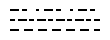


### stroke_width

```python
for i in range(20):
    d.append(dw.Line((i+1)*15,10,(i+1)*15,90,stroke='black',stroke_width=abs(10-i)+1))
```
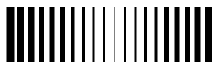


### stroke_linecap

`stroke_linecap` can be set to `butt , round`, or `square`. 
Note that the latter two extend beyond the coordinates.

```python
d.append(dw.Line(10,15,50,15,stroke='black',stroke_linecap='butt',stroke_width=15))
d.append(dw.Line(10,45,50,45,stroke='black',stroke_linecap='round',stroke_width=15))
d.append(dw.Line(10,75,50,75,stroke='black',stroke_linecap='square',stroke_width=15))
# guide lines
d.append(dw.Lines(10,0,10,100,stroke='#999'))
d.append(dw.Lines(50,0,50,100,stroke='#999'))
```
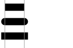


### stroke_linejoin

Define the way lines connect at a corner with `stroke-linejoin`: `miter` (pointed),
`round`, or `bevel` (flat).

```python
d.append(dw.Line(0,20,300,20,stroke='gray'))
g = dw.Group(stroke_width=20,stroke='black',fill='none')
g.append(dw.Lines(10,80,50,20,90,80,stroke_linejoin='miter'))
g.append(dw.Lines(110,80,150,20,190,80,stroke_linejoin='round'))
g.append(dw.Lines(210,80,250,20,290,80,stroke_linejoin='bevel'))
d.append(g)
```
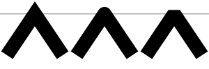


### stroke_miterlimit

When two line segments meet at a sharp angle and miter joins have been specified 
for `stroke-linejoin`, it is possible for the miter to extend far beyond the 
thickness of the line stroking the path. The `stroke-miterlimit` imposes a 
limit on the ratio of the miter length to the `stroke-width`. 
When the limit is exceeded, the join is converted from a miter to a bevel.
(From [W3C doc](https://www.w3.org/TR/SVG11/painting.html#StrokeMiterlimitProperty))

```python
d.append(dw.Line(0,30,300,30,stroke='gray'))
g = dw.Group(stroke_width=20,stroke='black',fill='none',stroke_linejoin='miter')
g.append(dw.Lines(10,90,40,30,70,90))
g.append(dw.Lines(100,90,130,30,160,90,stroke_miterlimit=2.3)) #jumps between 2.2 and 2.3
g.append(dw.Lines(190,90,220,30,250,90,stroke_miterlimit=1))
d.append(g)
```
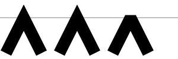


## Path
```
path = dw.Path(**kwargs)
```
The following Path specifiers are also availiable as lowercase characters. In
that case, their movements are relative to current location.

Note that in `draw2Svg` it is not possible to have more than one element in a
command. But it is possible to add the commands directly, for instance

```python
p = dw.Path()
p.M(100,100).L(200,100).L(200,200).Z
```


### M = moveto

```
path.M(x,y)
```
Move to `x,y` (and draw nothing).


### L = lineto

```
path.L(x,y)
```

Draw a straigt line to `x,y`.

```python
g = dw.Group(stroke='black',fill='none')

p = dw.Path()
p.M(10,10).L(100,10)
g.append(p)

p = dw.Path()
p.M(10,20).L(100,20).L(100,50)
g.append(p)

p = dw.Path()
p.M(40,60).L(10,60).L(40,42)
p.M(60,60).L(90,60).L(60,42)
g.append(p)
```
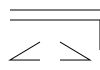


### H = horizontal line

```
path.H(x)
```

Draw a horizontal line to the new `x` location.


### V = vertical line

```
path.V(x)
```

Draw a vertical line to the new `y` location.

```python
p = dw.Path(stroke='black',fill='none')
d.append(p.M(10,10).H(100))
d.append(p.M(10,20).H(100).V(50))
```
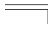


### Q = quadratic Bézier curve (one control point)

```
path.Q(x_ctl,y_ctl,x_end,y_end)
```

Draw a quadratic Bézier curve from current location to `x_end,y_end` by means
of `x_ctl,y_ctl`.

```python
# curve only (left)
p = dw.Path(stroke='black',fill='none',stroke_width=3)
d.append(p.M(30,75).Q(240,30,300,120))
# with control point and construction lines
d.append(dw.Use(p,300,0))
g = dw.Group(stroke='gray',fill='gray')
g.append(dw.Circle(330,75,3))
g.append(dw.Circle(600,120,3))
g.append(dw.Circle(540,30,3))
g.append(dw.Line(330,75,540,30))
g.append(dw.Line(540,30,600,120))
g.append(dw.Line(330,75,600,120,stroke_dasharray='5,5'))
g.append(dw.Circle(435,52.5,3))
g.append(dw.Circle(570,75,3))
g.append(dw.Line(435,52.5,570,75))
g.append(dw.Circle(502.5,63.75,4,fill='none'))
d.append(g)
```


### T = smooth quadratic Bézier curve (generated control point)

```
path.T(x,y)
```

Draws a quadratic Bézier curve from the current point to (x,y). The control 
point is assumed to be the reflection of the control point on the previous 
command relative to the current point. (If there is no previous command or if 
the previous command was not a Q, q, T or t, assume the control point is 
coincident with the current point.) 
(From [W3C Doc](https://www.w3.org/TR/SVG11/paths.html#PathDataQuadraticBezierCommands))

```python
# sequence left
p = dw.Path(stroke='black',fill='none',stroke_width=3)
d.append(p.M(30,60).Q(80,-10,100,60).Q(130,25,200,40))
# with smooth continuation right
p = dw.Path(stroke='black',fill='none',stroke_width=3,transform='translate(200,0)')
d.append(p.M(30,60).Q(80,-10,100,60).T(200,40))
```
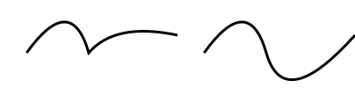


### C = cubic Bézier curve (two control points)

```
path.C(x_ctl_1,y_ctl_1,x_ctl_2,y_ctl_2,x_end,y_end)
```

Draw a cubic Bézier curve by means of two control points (one for start and
one for end).

```python
pnt_1 = (40,50)
pnt_2 = (110,50)
ctl_1_x = (10,60,110,110,60,110)
ctls_2 = ((140,10),(90,10),(40,10),(40,10),(90,90),(40,90))

for i in range(6):
    trans = 'translate(%d,0)' % i*100
    p = dw.Path(stroke='black',fill='none',stroke_width=3,transform=trans)
    ctl_1 = (ctl_1_x[i],10)
    ctl_2 = ctls_2[i]
    p.M(*pnt_1)
    p.C(*ctl_1,*ctl_2,*pnt_2)
    d.append(p)
    g = dw.Group(stroke='gray',fill='gray',stroke_width=1,transform=trans)
    g.append(dw.Circle(*ctl_1,2))
    g.append(dw.Circle(*ctl_2,2))
    g.append(dw.Line(*pnt_1,*ctl_1))
    g.append(dw.Line(*pnt_2,*ctl_2))
    d.append(g)
```


### S = smooth cubic Bézier (one control point)

Similar to `T` in quadratic Bézier curve. The first control point is calculated 
as reflection of the previous second control point.

```
path.S(x_ctl_2,y_ctl_2,x_end,y_end)
```

```python
pnt_1 = (30,100)
pnt_2 = (100,100)
pnt_3 = (200,80)
ctl_1 = (50,30)
ctl_2 = (70,50)
ctl_3 = (150,40)

p = dw.Path(stroke='black',fill='none',stroke_width=3)
p.M(*pnt_1)
p.C(*ctl_1,*ctl_2,*pnt_2)
p.S(*ctl_3,*pnt_3)
d.append(p)

for pnt,ctl in zip((pnt_1,pnt_2,pnt_3),(ctl_1,ctl_2,ctl_3)):
    d.append(dw.Circle(*pnt,4))
    d.append(dw.Circle(*ctl,2,stroke='gray',fill='gray'))
    d.append(dw.Line(*pnt,*ctl,stroke='gray'))
```


  
### A = elliptical Arc

```
path.A(rx,ry,rot,largeArc,sweep,ex,ey)
	rx,ry = radius 
	rot = x-axis rotation
	largeArc = 1 or 0
	sweep = 1 (positive) or 0 (negative) angle
	ex,ey = end point
```

```python
p = dw.Path(stroke='red')
d.append(p.M(125,75).A(100,50,rot=0,large_arc=0,sweep=0,ex=225,ey=125))
p = dw.Path(stroke='blue')
d.append(p.M(125,75).A(100,50,rot=0,large_arc=0,sweep=1,ex=225,ey=125))
p = dw.Path(stroke='rgb(0 80 255)',stroke_dasharray='5 3')
d.append(p.M(125,75).A(100,50,rot=0,large_arc=1,sweep=0,ex=225,ey=125))
p = dw.Path(stroke='rgb(255 80 0)',stroke_dasharray='5 3')
d.append(p.M(125,75).A(100,50,rot=0,large_arc=1,sweep=1,ex=225,ey=125))
```


### Z = closepath  

```
path.Z()
```

Close the path.

```python
p = dw.Path(stroke='black',fill='none')
d.append(p.M(10,10).h(30).v(50).h(-30).Z())
d.append(p.M(50,10).h(30).v(50).Z())
```
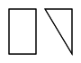


## Text
```
dw.Text(text, fontSize, x=None, y=None, *, center=False,
           line_height=1, line_offset=0, path=None, 
           start_offset=None, path_args=None, tspan_args=None, 
           cairo_fix=True, _skip_check=False, **kwargs)
```

### Fill and Outline

Default is black as fill colour and no outline.

```python
# control lines
l = dw.Path(stroke='gray')
l.M(20,0).V(370)
for i in range(1,7):
    l.M(10,i*60).H(500)
d.append(l)

# default text, with outline, and outline only
d.append(dw.Text('Simplest Text',x=20,y=60,font_size=50))
d.append(dw.Text('Outline / Filled',x=20,y=120,font_size=50,stroke='black'))
d.append(dw.Text('Too big stroke',x=20,y=180,font_size=50,stroke='black',stroke_width=5))
d.append(dw.Text('Outlined only',x=20,y=240,font_size=50,stroke='black',stroke_width=0.5,fill='none'))
d.append(dw.Text('Outlined and colored',x=20,y=300,font_size=50,stroke='black',fill='red'))
d.append(dw.Text('Colored fill only',x=20,y=360,font_size=50,fill='blue'))
```
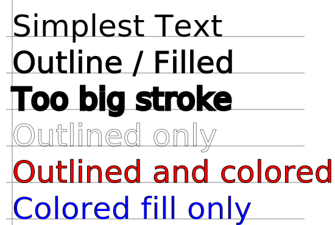


### Weight, Style, Decoration, Spacing

```python
d.append(dw.Text('bold',font_size=30,x=20,y=35,font_weight='bold'))
d.append(dw.Text('italic',font_size=30,x=20,y=75,font_style='italic'))
d.append(dw.Text('under',font_size=30,x=20,y=115,text_decoration='underline'))
d.append(dw.Text('over',font_size=30,x=20,y=155,text_decoration='overline'))
d.append(dw.Text('through',font_size=30,x=20,y=195,text_decoration='line-through'))
d.append(dw.Text('normal word space',font_size=30,x=200,y=35))
d.append(dw.Text('more word space',font_size=30,x=200,y=75,word_spacing=10))
d.append(dw.Text('less word space',font_size=30,x=200,y=115,word_spacing=-5))
d.append(dw.Text('wide letter space',font_size=30,x=200,y=155,letter_spacing=8))
d.append(dw.Text('narrow letter space',font_size=30,x=200,y=195,letter_spacing=-2))
```


### Text Alignment

Horizontal alignment (text_anchor) can be `start`, `middle` or `end`.

Vertical alignment (dominant_baseline) can be `auto`, `middle` or `hanging` (and more, see
[here](https://developer.mozilla.org/en-US/docs/Web/SVG/Attribute/dominant-baseline)).

```python
d.append(dw.Line(75,100,75,0,stroke='gray'))
d.append(dw.Line(140,30,250,30,stroke='gray'))
d.append(dw.Line(140,60,250,60,stroke='gray'))
d.append(dw.Line(140,90,250,90,stroke='gray'))
d.append(dw.Text('Start',24,75,30,text_anchor='start'))
d.append(dw.Text('Middle',24,75,60,text_anchor='middle'))
d.append(dw.Text('End',24,75,90,text_anchor='end'))
d.append(dw.Text('Auto',24,150,30,dominant_baseline='bottom'))
d.append(dw.Text('Middle',24,150,60,dominant_baseline='middle'))
d.append(dw.Text('Hanging',24,150,90,dominant_baseline='top'))
```
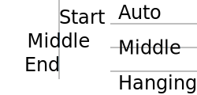


### TSpan

Continues a `Text` element.

```python
txt = dw.Text('Switch among ',24,10,40)
txt.append(dw.TSpan('italic',font_style='italic'))
txt.append(dw.TSpan(', normal, and '))
txt.append(dw.TSpan('bold',font_weight='bold'))
txt.append(dw.TSpan(' text.'))
d.append(txt)
```
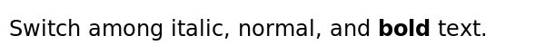


```python
txt = dw.Text('F',24,10,30)
txt.append(dw.TSpan('a',dy=5))
txt.append(dw.TSpan('l',dy=31,dx=21))
txt.append(dw.TSpan('l',dy=89,dx=54))
d.append(txt)
```
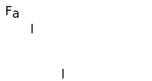

The same could be achieved by a list of dx/dy values:

```python
d.append(dw.Text('Fall',24,10,30,dx='0,0,21,54',dy='0,5,21,54'))
```
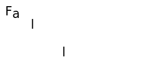


### Rotate

Either one angle (degrees), or a list which is applied to all characters.
If the list is smaller than the number of characters, the last angle persists.

```python
d.append(dw.Text('Rotate',20,20,20,letter_spacing=20,rotate='90'))
d.append(dw.Text('Rotate',20,20,80,letter_spacing=20,rotate='0 90 180 270'))
```
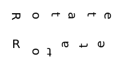


`TSpan` can also be used:

```python
from random import randrange
txt = dw.Text('',20,20,50,letter_spacing=20)
txt.append(dw.TSpan('R',rotate=randrange(360)))
txt.append(dw.TSpan('OT',rotate='50 20'))
txt.append(dw.TSpan('ATE',rotate=''.join([str(randrange(360)) for i in range(3)])))
d.append(txt)
```
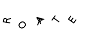


### Setting Text Length

```python
s = 'Two words'
d.append(dw.Text(s,20,20,30,textLength=250,lengthAdjust='spacing'))
d.append(dw.Text(s,20,20,70,textLength=250,lengthAdjust='spacingAndGlyphs'))
d.append(dw.Text(s+' (normal length)',20,20,110))
d.append(dw.Text(s,20,20,150,textLength=80,lengthAdjust='spacing'))
d.append(dw.Text(s,20,20,190,textLength=80,lengthAdjust='spacingAndGlyphs'))

d.append(dw.Line(20,10,20,195,stroke='gray'))
d.append(dw.Line(270,80,270,10,stroke='gray'))
d.append(dw.Line(100,130,100,195,stroke='gray'))
```
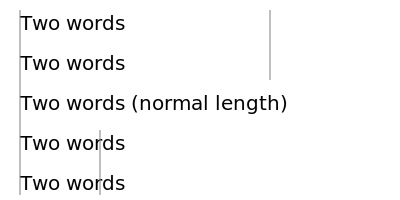


### Text on a Path

```python
curve_path = dw.Path(stroke='gray',fill='none')
curve_path.M(30,50).C(50,20,70,20,120,50).S(150,10,200,50)

round_corner = dw.Path(stroke='gray',fill='none')
round_corner.M(250,30).L(300,30).A(30,30,0,0,1,330,60).L(330,110)

sharp_corner = dw.Path(stroke='gray',fill='none')
sharp_corner.M(30,110).L(100,110).L(100,160)

discontinuous = dw.Path(stroke='gray',fill='none')
discontinuous.M(150,110).A(40,30,0,1,0,230,110).M(250,110).L(270,140)

center_curve = dw.Path(stroke='gray',fill='none')
center_curve.M(330,130).L(330,160).A(30,30,0,0,1,300,180).L(200,180)

d.append(curve_path)
d.append(round_corner)
d.append(sharp_corner)
d.append(discontinuous)
d.append(center_curve)

t_cp = dw.Text('Following a cubic Bézier curve',14,path=curve_path)
t_rc = dw.Text("Going 'round the bend",14,path=round_corner)
t_sc = dw.Text('Making a quick turn',14,path=sharp_corner)
t_dc = dw.Text('Text along a broken path',14,path=discontinuous)
t_ct = dw.Text('centered',14,path=center_curve,offset='50%',text_anchor='middle')

d.append(t_cp)
d.append(t_rc)
d.append(t_sc)
d.append(t_dc)
d.append(t_ct)
```
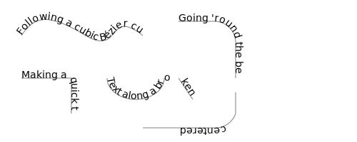

### Multi Line Text

This is a particular feature of drawSvg: A list of strings as input for Text()
is rendered as multi-line text.

```python
t = ['this is', 'a', 'multiline text', 'given as a', 'list']
d.append(dw.Text(t,14,50,20,text_anchor='middle'))
```

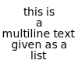

### Fonts

Specify fonts via font_family.

```python
d.append(dw.Text('Ein Taxt in Quicksand.',30,10,35,font_family='Quicksand'))
d.append(dw.Text('Ein Taxt in Cantarell.',30,10,75,font_family='Cantarell'))
d.append(dw.Text('Ein Taxt in Simvoni.',30,10,115,font_family='Simvoni'))
```

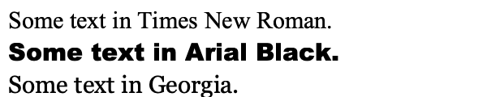

Specify a default font.

```python
d = dw.Drawing(600,120,font_family='Cantarell Light')
d.append(dw.Text('Ein Taxt in global setting (Cantarell Light).',30,10,35))
d.append(dw.Text('Ein Taxt in Cantarell.',30,10,75,font_family='Cantarell'))
d.append(dw.Text('Ein Taxt in Simvoni.',30,10,115,font_family='Simvoni'))
```

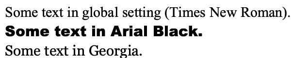


## Gradient, Clip, Mask

### Linear Gradient
```
gradient = dw.LinearGradient(x1, y1, x2, y2, gradientUnits='userSpaceOnUse', **kwargs)
gradient.add_stop(offset, color, opacity=None)
```
```python
grad = dw.LinearGradient(150,0,0,0)
grad.add_stop(0,'green')
grad.add_stop(1,'yellow')
d.append(dw.Rectangle(10,10,150,60,stroke='black',fill=grad))
```


### Radial Gradient
```
gradient = dw.RadialGradient(cx, cy, r, **kwargs)
gradient.add_stop(offset, color, opacity=None)
```

```python
gradient = dw.RadialGradient(200,150,100)
gradient.add_stop(0, 'green', 1)
gradient.add_stop(1, 'red', 1)
bg = dw.Rectangle(x=0,y=0,width="100%",height="100%",fill=gradient)
d.append(bg)
```
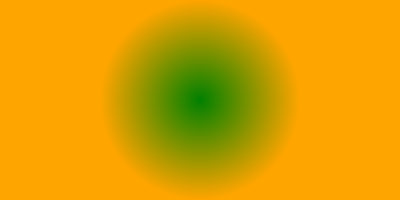


### Clip

```
clip_name = dw.ClipPath()
```

To add shape as Clip, use `.append()` method.
To apply Clip, fill `clip_path` argument with `clip_name`.

```python
# show both shapes as they are
d.append(dw.Rectangle(100,100,100,100,stroke='gray',fill='none'))
d.append(dw.Circle(100,100,100,fill='none',stroke='gray',stroke_dasharray='2,5'))
# apply rect as clip to circle
clip = dw.ClipPath()
clip.append(dw.Rectangle(100,100,100,100))
d.append(dw.Circle(100,100,100,fill="cyan",clip_path=clip))
```


Another example:

```
# draw a random path in the left half of the canvas
p = dw.Path(stroke='black',stroke_width=2,fill='none')
p.M(150,150)
from random import randint
for i in range(40):
    p.L(randint(0,300),randint(0,200))
d.append(p)

# circle as clipping shape
circ = dw.Circle(150,100,75)
c = dw.ClipPath()
c.append(circ)

# repeat lines in the right half and apply clipping
d.append(dw.Use(p,300,0,clip_path=c))
```
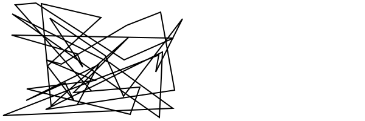


Complex clip path:

```python
curve1 = dw.Path(stroke='black',fill='none')
curve1.M(5,55).C(25,5, 45,-25, 75,55).C(85,85, 20,105, 40,55).Z()

curveClip = dw.ClipPath()
curveClip.append(curve1)

text1 = dw.Text('CLIP',48,20,20,stroke='black',fill='none',transform='rotate(60)')
textClip = dw.ClipPath()
textClip.append(text1)

shapes = dw.Group()
shapes.append(dw.Rectangle(0,50,90,60,fill='#999'))
shapes.append(dw.Circle(25,25,25,fill='#666'))
shapes.append(dw.Lines(30,0,80,0,80,100,close='true',fill='#ccc'))

# draw shapes with clip path
d.append(dw.Use(shapes,0,0,clip_path=curveClip))

# show clip path
g = dw.Group(transform='translate(100,0)')
g.append(shapes)
g.append(curve1)
d.append(g)

# draw shapes with text as clip path
d.append(dw.Use(shapes,0,150,clip_path=textClip))

# show text clip path
g = dw.Group(transform='translate(100,150)')
g.append(shapes)
g.append(text1)
d.append(g)
```
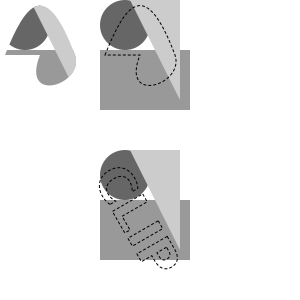


### Mask
```
mask_name = dw.Mask()
```

The transparency of the masking object is transfered to the masked object.
Opaque pixels of the mask produce opaque pixels of the masked object.
Transparent parts of the mask make the corresponding parts of the masked object
invisible.

```python
gradient = dw.LinearGradient(*[0,0],*[1,0], gradientUnits='objectBoundingBox')
gradient.add_stop(0, 'white')
gradient.add_stop(1, 'black')

mask = dw.Mask()
box = dw.Rectangle(
    x=30,y=0,
    width=100,height=100,
    fill=gradient)
mask.append(box)

#initial shape
rect = dw.Rectangle(
        x=0,y=0,
        width=200,height=100,
        fill="cyan",)
d.append(rect)

#After Mask
rect = dw.Rectangle(
        x=0,y=0,
        width=200,height=100,
        fill="pink", mask=mask)
d.append(rect)
```
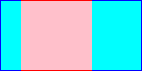


Mask using opaque colors:

```python
# define the masks
redmask = dw.Mask(maskContentUnits='objectBoundingBox')
redmask.append(dw.Rectangle(0,0,1,1,fill='#f00'))
greenmask = dw.Mask(maskContentUnits='objectBoundingBox')
greenmask.append(dw.Rectangle(0,0,1,1,fill='#0f0'))
bluemask = dw.Mask(maskContentUnits='objectBoundingBox')
bluemask.append(dw.Rectangle(0,0,1,1,fill='#00f'))
whitemask = dw.Mask(maskContentUnits='objectBoundingBox')
whitemask.append(dw.Rectangle(0,0,1,1,fill='#fff'))

# display the colors
d.append(dw.Rectangle(10,10,50,50,fill='#f00'))
d.append(dw.Rectangle(70,10,50,50,fill='#0f0'))
d.append(dw.Rectangle(130,10,50,50,fill='#00f'))
d.append(dw.Rectangle(190,10,50,50,fill='#fff',stroke='black'))

# mask
g = dw.Group(mask=redmask)
g.append(dw.Circle(35,115,25,fill='black'))
g.append(dw.Text('Red',14,35,80,text_anchor='middle'))
d.append(g)
g = dw.Group(mask=greenmask)
g.append(dw.Circle(95,115,25,fill='black'))
g.append(dw.Text('Green',14,95,80,text_anchor='middle'))
d.append(g)
g = dw.Group(mask=bluemask)
g.append(dw.Circle(155,115,25,fill='black'))
g.append(dw.Text('Blue',14,155,80,text_anchor='middle'))
d.append(g)
g = dw.Group(mask=whitemask)
g.append(dw.Circle(215,115,25,fill='black'))
g.append(dw.Text('White',14,215,80,text_anchor='middle'))
d.append(g)
```
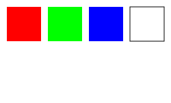


Mask alpha using opacity only:

```python
fullmask = dw.Mask(maskContentUnits='objectBoundingBox')
fullmask.append(dw.Rectangle(0,0,1,1,fill_opacity=1.0,fill='white'))
three_fourths = dw.Mask(maskContentUnits='objectBoundingBox')
three_fourths.append(dw.Rectangle(0,0,1,1,fill_opacity=0.75,fill='white'))
one_half = dw.Mask(maskContentUnits='objectBoundingBox')
one_half.append(dw.Rectangle(0,0,1,1,fill_opacity=0.5,fill='white'))
one_fourth = dw.Mask(maskContentUnits='objectBoundingBox')
one_fourth.append(dw.Rectangle(0,0,1,1,fill_opacity=0.25,fill='white'))

g = dw.Group(mask=fullmask)
g.append(dw.Circle(35,35,25))
g.append(dw.Text('100%',14,35,80,text_anchor='middle'))
d.append(g)
g = dw.Group(mask=three_fourths)
g.append(dw.Circle(95,35,25))
g.append(dw.Text('50%',14,95,80,text_anchor='middle'))
d.append(g)
g = dw.Group(mask=one_half)
g.append(dw.Circle(155,35,25))
g.append(dw.Text('50%',14,155,80,text_anchor='middle'))
d.append(g)
g = dw.Group(mask=one_fourth)
g.append(dw.Circle(215,35,25))
g.append(dw.Text('25%',14,215,80,text_anchor='middle'))
d.append(g)
```
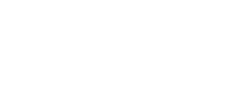


## Group, Use, Defs, Image

### Group
```
dw.Group(**kwargs)
```
Any style specified in the g tag will apply to all child elements in the group.

```python
g_house = dw.Group(id='house',fill='none',stroke='black')
g_house.append(dw.Rectangle(6,50,60,60))
g_house.append(dw.Lines(6,50,36,9,66,50))
g_house.append(dw.Lines(36,110,36,80,50,80,50,110))
d.append(g_house)

g_man = dw.Group(id='man',fill='none',stroke='blue')
g_man.append(dw.Circle(85,56,10))
g_man.append(dw.Line(85,66,85,80))
g_man.append(dw.Lines(76,104,85,80,94,104))
g_man.append(dw.Lines(76,70,85,76,94,70))
d.append(g_man)

g_woman = dw.Group(id='woman',fill='none',stroke='red')
g_woman.append(dw.Circle(110,56,10))
g_woman.append(dw.Lines(110,66, 110,80, 100,90, 120,90, 110,80))
g_woman.append(dw.Line(104,104,108,90))
g_woman.append(dw.Line(112,90,116,104))
g_woman.append(dw.Lines(101,70, 110,76, 119,70))
d.append(g_woman)
```
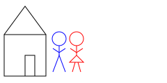


### Use

```
dw.Use(otherElem, x, y, **kwargs)
```

```python
g_house = dw.Group(id='house',fill='none',stroke='black')
g_house.append(dw.Rectangle(6,50,60,60))
g_house.append(dw.Lines(6,50,36,9,66,50))
g_house.append(dw.Lines(36,110,36,80,50,80,50,110))
d.append(g_house)

# use id which is set
d.append(dw.Use('house',100,50))
# or use variable name
d.append(dw.Use(g_house,150,20))
```
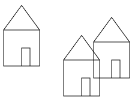


### Defs

Elements that are not `append`ed to the drawing but are referenced by other 
elements will automatically be included in `<defs></defs>`.
([source](https://github.com/cduck/drawSvg/issues/46))

```python
d = dw.Drawing(200,200,id_prefix='defs')

# Do not append `bond` to the drawing
bond = dw.Line(0, 0, 10, 10, stroke='black')

# `bond` is automatically added into <defs>
# A default `id` is generated if one isn't set
d.append(dw.Use(bond, 20, 50))
d.append(dw.Use(bond, 50, 50))
d.append(dw.Use(bond, 80, 50))

print(d.as_svg())
```

Output:
```
<defs>
<path d="M0,0 L10,10" stroke="black" id="defs0" />
</defs>
<use xlink:href="#defs0" x="20" y="50" />
<use xlink:href="#defs0" x="50" y="50" />
<use xlink:href="#defs0" x="80" y="50" />
```


### Image

```
dw.Image(x, y, width, height, path=None, data=None, 
		embed=False, mimeType=None, **kwargs)
```

```python
d.append(dw.Image(0,0,200,200,'example1.png',embed=True))
```
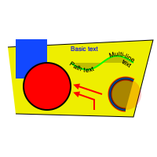


## Transformations


### Translate

```
transform = 'translate(x,y)'
```

This can be added to many objects. Simple example:

```
d.append(dw.Rectangle(0,0,40,40,transform='translate(50,50)'))
```
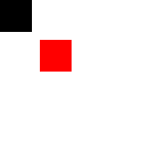


### Scale

```
transform = 'scale(x_mult[,y_mult])'
```

Note that scaling touches also stroke width.

```python
square = dw.Rectangle(0,0,40,40,fill='none',stroke='black',stroke_width=2)
d.append(dw.Use(square,10,10,transform='scale(2)'))
```
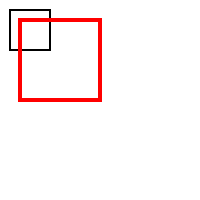


It is possible to specify x and y scale seperately:

```python
square = dw.Rectangle(0,0,40,40,fill='none',stroke='black',stroke_width=2)
d.append(dw.Use(square,10,10))
d.append(dw.Use(square,10,10,transform='scale(3,1.5)'))
```
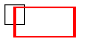


Scaling around a center point:

```python
# center of scaling
d.append(dw.Circle(100,100,4,fill='black'))
# non-scaled rectangle
rect = dw.Rectangle(70,80,60,40,stroke='black',fill='none')
d.append(rect)
# scaled rectangles (point times scale-1)
d.append(dw.Use(rect,0,0,transform='translate(-100,-100) scale(2)',stroke_width=0.5))
d.append(dw.Use(rect,0,0,transform='translate(-150,-150) scale(2.5)',stroke_width=0.4))
d.append(dw.Use(rect,0,0,transform='translate(-200,-200) scale(3)',stroke_width=0.33))
```


### Rotate

```
transform = 'rotate(angle, cx=0, cy=0)
```
`angle` counts clockwise in degrees; `cx/cy` are the center of rotation.

```python
# show frame
d.append(dw.Rectangle(0,0,200,200,stroke='gray',fill='none'))
# rotation is around (0,0)
d.append(dw.Rectangle(70,30,40,40,fill='gray'))
d.append(dw.Rectangle(70,30,40,40,fill='black',transform='rotate(45)'))
```
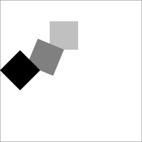


```python
# center of rotation
d.append(dw.Circle(100,100,3,fill='black'))
# non-rotated arrow
g = dw.Group(id='arrow',stroke='black')
g.append(dw.Line(110,100,160,100))
g.append(dw.Lines(160,100,155,95,155,105,fill='black'))
d.append(g)
# rotated arrows 
d.append(dw.Use(g,0,0,transform='rotate (60,100,100)'))
d.append(dw.Use(g,0,0,transform='rotate (-90,100,100)'))
d.append(dw.Use(g,0,0,transform='rotate (-150,100,100)'))
```
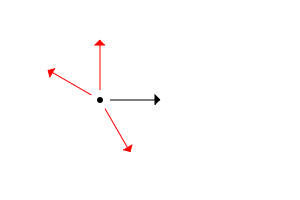


### Skew

```
transform = 'skewX(angle)`
transform = 'skewY(angle)`
```

```python
g = dw.Group(stroke='gray',stroke_dasharray='4 4')
g.append(dw.Line(0,0,200,0))
g.append(dw.Line(20,0,20,90))
g.append(dw.Line(120,0,120,90))
d.append(g)

h = dw.Group(transform='translate(20,0)')
h1 = dw.Group(transform='skewX(30)')
h1.append(dw.Lines(50,0,0,0,0,50,stroke='black',fill='none',stroke_width=2))
h1.append(dw.Text('skewX',16,0,60))
h.append(h1)
d.append(h)

i = dw.Group(transform='translate(120,0)')
i1 = dw.Group(transform='skewY(30)')
i1.append(dw.Lines(50,0,0,0,0,50,stroke='black',fill='none',stroke_width=2))
i1.append(dw.Text('skewY',16,0,60))
i.append(i1)
d.append(i)
```


### Cartesian Coordinates

A drawing which can be translated to cartesian coordinates by setting 
the y `translate` value to the drawing's height, and also applying 
`scale(1,-1)`.

Trapezoid with (0,0) top left:

```python
d = dw.Drawing(200,200)
d.append(dw.Line(0,0,100,0,stroke='black'))
d.append(dw.Line(0,0,0,100,stroke='black'))
d.append(dw.Lines(40,40,100,40,70,70,40,70,fill='gray',stroke='black'))
```


Translated to (0,0) bottom left:

```python
d = dw.Drawing(200,200)
g = dw.Group(transform='translate(0,200) scale(1,-1)')
g.append(dw.Line(0,0,100,0,stroke='black'))
g.append(dw.Line(0,0,0,100,stroke='black'))
g.append(dw.Lines(40,40,100,40,70,70,40,70,fill='gray',stroke='black'))
d.append(g)
```
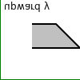

Or even applying `scale(1,-1)` to the whole drawing:

```python
d = dw.Drawing(200,200,transform='scale(1,-1)')
d.append(dw.Line(0,0,100,0,stroke='black'))
d.append(dw.Line(0,0,0,100,stroke='black'))
d.append(dw.Lines(40,40,100,40,70,70,40,70,fill='gray',stroke='black'))
```


## Credits

Written by joachim heintz 2023.

Most examples are based on J. David Eisenberg, SVG Essentials, O'Reilly 2002.

Thanks to [Ahmad Aufar Husaini](https://github.com/aufarah)
for his fork (draw2Svg) and for providing some documentation
[here](https://draw2svg.netlify.app/)
(some examples are used in this Quick Reference).

Thanks to [Casey Duckering](https://github.com/cduck) for drawSvg and many
helpful explanations on its [discussion page](https://github.com/cduck/drawSvg/discussions).
