# Drawsvg Quick Reference

Repository: [https://github.com/cduck/drawsvg](https://github.com/cduck/drawsvg)


```python
import drawsvg as dw
```


## Canvas and Document Structure

```python
d = dw.Drawing(width, height, origin=(0, 0),
               context: drawsvg.types.Context = None, animation_config=None,
               id_prefix='d', **svg_args)
```

It is recommended to use a unique `id_prefix` for each svg if you embed multiple on a web page.

```python
d = dw.Drawing(400, 300, id_prefix='pic')
```


## Basic Shapes

### One Line

```python
dw.Line(sx, sy, ex, ey, **kwargs)
```

```python
line = dw.Line(30, 30, 90, 90, stroke='black')
d.append(line)
```


### Multiple Lines

This is SVG's `polyline` (but drawsvg renders as path with multiple L).

```python
dw.Lines(sx, sy, *points, close=False, **kwargs)
```

```python
lines = dw.Lines(10, 90, 10, 10, 80, 90, 80, 10,
                 fill='none', stroke='black')
d.append(lines)
```


```python
x = [30 + x*10 for x in range(20)]
y = [80, 20]*10
xy = [item for sublist in zip(x, y) for item in sublist]
d.append(dw.Lines(*xy, stroke='black', stroke_width=5, fill='none'))
```


### Polygon

SVG `Polygon` is drawsvg `Lines` with `close=True`.

```python
polygon = dw.Lines(15, 10, 55, 10, 45, 20, 5, 20,
                   fill='red', stroke='black', close='true')
star = dw.Lines(48, 16, 16, 96, 96, 48, 0, 48, 88, 96,
                stroke='black', fill='none', close='true')
d.append(star)
```


### Rectangle

```python
dw.Rectangle(x, y, width, height, **kwargs)
```

```python
# Black interior, no outline
d.append(dw.Rectangle(10, 10, 90, 150))
# No interior, black outline
d.append(dw.Rectangle(120, 10, 60, 120,
                      fill='none', stroke='black'))
# Blue interior, thick semi-transparent red outline
d.append(dw.Rectangle(210, 10, 75, 90,
                      fill='#0000ff', stroke='red',
                      stroke_width=7, stroke_opacity=0.5))
# Semi-transparent yellow interior, dashed green outline
d.append(dw.Rectangle(300, 10, 105, 60,
                      fill='yellow', fill_opacity=0.5,
                      stroke='green', stroke_width=2,
                      stroke_dasharray='5,2'))
```


Rounded corners:

```python
# Define both rx and ry
d.append(dw.Rectangle(10, 10, 80, 180, rx='10', ry='10',
                      stroke='black', fill='none'))
# If only one is given, it applies to both
d.append(dw.Rectangle(110, 10, 80, 180, ry='20',
                      stroke='black', fill='none'))
d.append(dw.Rectangle(210, 10, 80, 180, rx='40',
                      stroke='black', fill='none'))
# Rx and ry unequal
d.append(dw.Rectangle(310, 10, 80, 180, rx='30', ry='10',
                      stroke='black', fill='none'))
d.append(dw.Rectangle(410, 10, 80, 180, rx='10', ry='30',
                      stroke='black', fill='none'))
```


### Circle

```python
dw.Circle(cx, cy, r, **kwargs)
```

cx and cy point to circle's center, r refer to its radius

```python
d.append(dw.Circle(50, 50, 40))
d.append(dw.Circle(150, 50, 40,
                   stroke='black', fill='none'))
d.append(dw.Circle(250, 50, 40,
                   stroke='black', fill='none',
                   stroke_width=15))
```


### Ellipse

```python
dw.Ellipse(cx, cy, rx, ry, **kwarg)
```
(cx,cy) points to the center and (rx,ry) tells its radius

```python
d.append(dw.Ellipse(50, 50, 50, 30))
d.append(dw.Ellipse(160, 50, 50, 30,
                    stroke='black', fill='none'))
d.append(dw.Ellipse(250, 50, 30, 45,
                    stroke='black',fill='none'))
```


## Color and Painting Properties

For a full list, see [W3C specifications](https://www.w3.org/TR/SVG11/styling.html).


### fill and stroke\_color

Some color keyword names are:
aqua, black, blue, fuchsia, gray, green, lime, maroon, navy, olive, purple, red, silver, teal, white, and yellow.

Also supported is `#rrggbb`, `#rgb` (hexadecimal), or `rgb(R,G,B)` with 0-255 or with 0-100% for each value.

```python
c = ['red', '#9f9', '#9999ff', 'rgb(255,128,64)', 'rgb(60%,20%,60%)']
for i in range(5):
    y = (i + 1)*10
    d.append(dw.Line(10, y, 80, y,
                     stroke=c[i], stroke_width=5))
```

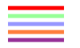


### fill\_opacity and stroke\_opacity

Value range from 0 = transparent to 1 = solid.

```python
for i in range(5):
    y = (i + 1)*10
    d.append(dw.Line(0, y, 290, y,
                     stroke='black', stroke_width=5,
                     stroke_opacity=i/5 + 0.1))
    d.append(dw.Rectangle(i*60, 70, 50, 50,
                          fill='red', fill_opacity=i/5+0.1))
```

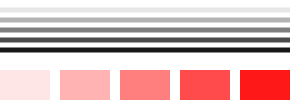


### stroke\_dasharray

```python
# Nine-pixel dash, five-pixel gap
d.append(dw.Line(10, 10, 100, 10,
                 stroke='black', stroke_width=2,
                 stroke_dasharray='9,5'))
# Five-pixel dash, three-pixel gap, nine-pixel dash, two-pixel gap
d.append(dw.Line(10, 20, 100, 20,
                 stroke='black', stroke_width=2,
                 stroke_dasharray='5,3,9,2'))
# Odd number of entries alternates dashes and gaps
d.append(dw.Line(10, 30, 100, 30,
                 stroke='black', stroke_width=2,
                 stroke_dasharray='9,3,5'))
```


### stroke\_width

```python
for i in range(20):
    d.append(dw.Line((i+1)*15, 10, (i+1)*15, 90,
                     stroke='black', stroke_width=abs(10-i)+1))
```


### stroke\_linecap

`stroke_linecap` can be set to `butt`, `round`, or `square`.
Note that the latter two extend beyond the end coordinates.

```python
d.append(dw.Line(10, 15, 50, 15,
                 stroke='black', stroke_width=15,
                 stroke_linecap='butt'))
d.append(dw.Line(10, 45, 50, 45,
                 stroke='black', stroke_width=15,
                 stroke_linecap='round'))
d.append(dw.Line(10, 75, 50, 75,
                 stroke='black', stroke_width=15,
                 stroke_linecap='square'))
# Guide lines
d.append(dw.Lines(10, 0, 10, 100, stroke='#999'))
d.append(dw.Lines(50, 0, 50, 100, stroke='#999'))
```


### stroke\_linejoin

Define the way lines connect at a corner with `stroke-linejoin`: `miter` (pointed), `round`, or `bevel` (flat).

```python
d.append(dw.Line(0, 20, 300, 20, stroke='gray'))
g = dw.Group(stroke_width=20, stroke='black', fill='none')
g.append(dw.Lines(10, 80, 50, 20, 90, 80,
                  stroke_linejoin='miter'))
g.append(dw.Lines(110, 80, 150, 20, 190, 80,
                  stroke_linejoin='round'))
g.append(dw.Lines(210, 80, 250, 20, 290, 80,
                  stroke_linejoin='bevel'))
d.append(g)
```


### stroke\_miterlimit

When two line segments meet at a sharp angle and miter joins have been specified for `stroke-linejoin`,
it is possible for the miter to extend far beyond the thickness of the line stroking the path.
The `stroke-miterlimit` imposes a limit on the ratio of the miter length to the `stroke-width`.
When the limit is exceeded, the join is converted from a miter to a bevel.
(From [W3C doc](https://www.w3.org/TR/SVG11/painting.html#StrokeMiterlimitProperty))

```python
d.append(dw.Line(0, 30, 300, 30, stroke='gray'))
g = dw.Group(stroke_width=20, stroke='black',
             fill='none', stroke_linejoin='miter')
g.append(dw.Lines(10, 90, 40, 30, 70, 90))
g.append(dw.Lines(100, 90, 130, 30, 160, 90,
                  stroke_miterlimit=2.3))
g.append(dw.Lines(190, 90, 220, 30, 250, 90,
                  stroke_miterlimit=1))
d.append(g)
```


## Path

```python
path = dw.Path(**kwargs)
```

The following Path specifiers are also available as lowercase characters.
In that case, their movements are relative to current location.


### M: moveto

```python
path.M(x, y)
```

Move to `x, y` (and draw nothing).


### L: lineto

```python
path.L(x, y)
```

Draw a straight line to `x, y`.

```python
g = dw.Group(stroke='black', fill='none')

p = dw.Path()
p.M(10, 10).L(100, 10)
g.append(p)

p = dw.Path()
p.M(10, 20).L(100, 20).L(100, 50)
g.append(p)

p = dw.Path()
p.M(40, 60).L(10, 60).L(40, 42)
p.M(60, 60).L(90, 60).L(60, 42)
g.append(p)

d.append(g)
```


### H: horizontal line

```python
path.H(x)
```

Draw a horizontal line to the new `x` location.


### V: vertical line

```python
path.V(y)
```

Draw a vertical line to the new `y` location.

```python
p = dw.Path(stroke='black', fill='none')
d.append(p.M(10, 10).H(100))
d.append(p.M(10, 20).H(100).V(50))
```


### Q: quadratic Bézier curve (one control point)

```python
path.Q(x_ctl, y_ctl, x_end, y_end)
```

Draw a quadratic Bézier curve from current location to `x_end, y_end` by means of `x_ctl, y_ctl`.

```python
# Curve only (left)
p = dw.Path(stroke='black', fill='none', stroke_width=3)
d.append(p.M(30, 75).Q(240, 30, 300, 120))
# With control point and construction lines
d.append(dw.Use(p, 300, 0))
g = dw.Group(stroke='gray', fill='gray')
g.append(dw.Circle(330, 75, 3))
g.append(dw.Circle(600, 120, 3))
g.append(dw.Circle(540, 30, 3))
g.append(dw.Line(330, 75, 540, 30))
g.append(dw.Line(540, 30, 600, 120))
g.append(dw.Line(330, 75, 600, 120, stroke_dasharray='5,5'))
g.append(dw.Circle(435, 52.5, 3))
g.append(dw.Circle(570, 75, 3))
g.append(dw.Line(435, 52.5, 570, 75))
g.append(dw.Circle(502.5, 63.75, 4, fill='none'))
d.append(g)
```


### T: smooth quadratic Bézier curve (generated control point)

```python
path.T(x, y)
```

Draws a quadratic Bézier curve from the current point to (x, y).
The control point is assumed to be the reflection of the control point on the previous command relative to the current point.
If there is no previous command or if the previous command was not a Q, q, T or t, assume the control point is coincident with the current point.
(From [W3C Doc](https://www.w3.org/TR/SVG11/paths.html#PathDataQuadraticBezierCommands))

```python
# Curve sequence (left)
p = dw.Path(stroke='black', fill='none', stroke_width=3)
d.append(p.M(30, 60).Q(80, -10, 100, 60).Q(130, 25, 200, 40))
# With smooth continuation (right)
p = dw.Path(stroke='black', fill='none', stroke_width=3,
            transform='translate(200,0)')
d.append(p.M(30, 60).Q(80, -10, 100, 60).T(200, 40))
```


### C: cubic Bézier curve (two control points)

```python
path.C(x_ctl_1, y_ctl_1, x_ctl_2, y_ctl_2, x_end, y_end)
```

Draw a cubic Bézier curve by means of two control points (one for start and one for end).

```python
pnt_1 = (40, 50)
pnt_2 = (110, 50)
ctl_1_x = (10, 60, 110, 110, 60, 110)
ctls_2 = ((140, 10), (90, 10), (40, 10), (40, 10), (90, 90), (40, 90))

for i in range(6):
    trans = f'translate({i*100},0)'
    p = dw.Path(stroke='black', fill='none',
                stroke_width=3, transform=trans)
    ctl_1 = (ctl_1_x[i], 10)
    ctl_2 = ctls_2[i]
    p.M(*pnt_1)
    p.C(*ctl_1, *ctl_2, *pnt_2)
    d.append(p)
    g = dw.Group(stroke='gray', fill='gray',
                 stroke_width=1, transform=trans)
    g.append(dw.Circle(*ctl_1, 2))
    g.append(dw.Circle(*ctl_2, 2))
    g.append(dw.Line(*pnt_1, *ctl_1))
    g.append(dw.Line(*pnt_2, *ctl_2))
    d.append(g)
```

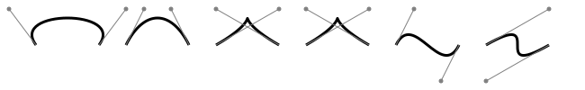


### S: smooth cubic Bézier (one control point)

Similar to `T` in quadratic Bézier curve. The first control point is calculated as reflection of the previous second control point.

```python
path.S(x_ctl_2, y_ctl_2, x_end, y_end)
```

```python
pnt_1 = (30, 100)
pnt_2 = (100, 100)
pnt_3 = (200, 80)
ctl_1 = (50, 30)
ctl_2 = (70, 50)
ctl_3 = (150, 40)

p = dw.Path(stroke='black', fill='none', stroke_width=3)
p.M(*pnt_1)
p.C(*ctl_1, *ctl_2, *pnt_2)
p.S(*ctl_3, *pnt_3)
d.append(p)

for pnt, ctl in zip((pnt_1, pnt_2, pnt_3), (ctl_1, ctl_2, ctl_3)):
    d.append(dw.Circle(*pnt, 4))
    d.append(dw.Circle(*ctl, 2, stroke='gray', fill='gray'))
    d.append(dw.Line(*pnt, *ctl, stroke='gray'))
```

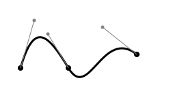


### A: elliptical Arc

```python
path.A(rx, ry, rot, largeArc, sweep, ex, ey)

    rx, ry: radius
    rot: x-axis rotation
    largeArc: True or False
    sweep: True (positive) or False (negative) angle
    ex, ey: end point
```

```python
p = dw.Path(stroke='red')
d.append(p.M(125, 75).A(100, 50, rot=0, large_arc=0, sweep=0, ex=225, ey=125))
p = dw.Path(stroke='blue')
d.append(p.M(125, 75).A(100, 50, rot=0, large_arc=0, sweep=1, ex=225, ey=125))
p = dw.Path(stroke='rgb(0 80 255)',stroke_dasharray='5 3')
d.append(p.M(125, 75).A(100, 50, rot=0, large_arc=1, sweep=0, ex=225, ey=125))
p = dw.Path(stroke='rgb(255 80 0)',stroke_dasharray='5 3')
d.append(p.M(125, 75).A(100, 50, rot=0, large_arc=1, sweep=1, ex=225, ey=125))
```


### Z: closepath

```python
path.Z()
```

Close the path.

```python
p = dw.Path(stroke='black', fill='none')
d.append(p.M(10, 10).h(30).v(50).h(-30).Z())
d.append(p.M(50, 10).h(30).v(50).Z())
```


## Text
```python
dw.Text(text, fontSize, x=None, y=None, *, center=False,
        line_height=1, line_offset=0, path=None,
        start_offset=None, path_args=None, tspan_args=None,
        cairo_fix=True, **kwargs)
```

### Fill and Outline

Default is black as fill color and no outline.

```python
# Reference lines
l = dw.Path(stroke='gray')
l.M(20, 0).V(370)
for i in range(1, 7):
    l.M(10, i*60).H(500)
d.append(l)

d.append(dw.Text('Simplest Text', font_size=50, x=20, y=60))
d.append(dw.Text('Outline / Filled', font_size=50, x=20, y=120, stroke='black'))
d.append(dw.Text('Too big stroke', font_size=50, x=20, y=180, stroke='black', stroke_width=5))
d.append(dw.Text('Outlined only', font_size=50, x=20, y=240, stroke='black', stroke_width=0.5, fill='none'))
d.append(dw.Text('Outlined and colored', font_size=50, x=20, y=300, stroke='black', fill='red'))
d.append(dw.Text('Colored fill only', font_size=50, x=20, y=360, fill='blue'))
```


### Weight, Style, Decoration, Spacing

```python
d.append(dw.Text('bold', font_size=30, x=20, y=35, font_weight='bold'))
d.append(dw.Text('italic', font_size=30, x=20, y=75, font_style='italic'))
d.append(dw.Text('under', font_size=30, x=20, y=115, text_decoration='underline'))
d.append(dw.Text('over', font_size=30, x=20, y=155, text_decoration='overline'))
d.append(dw.Text('through', font_size=30, x=20, y=195, text_decoration='line-through'))
d.append(dw.Text('normal word space', font_size=30, x=200, y=35))
d.append(dw.Text('more word space', font_size=30, x=200, y=75, word_spacing=10))
d.append(dw.Text('less word space', font_size=30, x=200, y=115, word_spacing=-5))
d.append(dw.Text('wide letter space', font_size=30, x=200, y=155, letter_spacing=8))
d.append(dw.Text('narrow letter space', font_size=30, x=200, y=195, letter_spacing=-2))
```

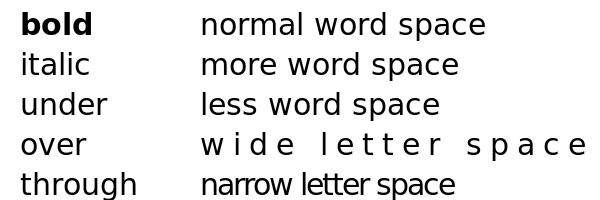


### Text Alignment

Horizontal alignment (`text_anchor`) can be `'start'`, `'middle'` or `'end'`.

Vertical alignment (`dominant_baseline`) can be `'auto'`, `'middle'` or `'hanging'`
(and more, see [here](https://developer.mozilla.org/en-US/docs/Web/SVG/Attribute/dominant-baseline)).

```python
d.append(dw.Line(75, 100, 75, 0, stroke='gray'))
d.append(dw.Line(140, 30, 250, 30, stroke='gray'))
d.append(dw.Line(140, 60, 250, 60, stroke='gray'))
d.append(dw.Line(140, 90, 250, 90, stroke='gray'))
d.append(dw.Text('Start', 24, 75, 30, text_anchor='start'))
d.append(dw.Text('Middle', 24, 75, 60, text_anchor='middle'))
d.append(dw.Text('End', 24, 75, 90, text_anchor='end'))
d.append(dw.Text('Auto', 24, 150, 30, dominant_baseline='auto'))
d.append(dw.Text('Middle', 24, 150, 60, dominant_baseline='middle'))
d.append(dw.Text('Hanging', 24, 150, 90, dominant_baseline='hanging'))
```

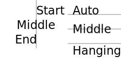


### TSpan

Continues a `Text` element.

```python
txt = dw.Text('Switch among ', 24, 10, 40)
txt.append(dw.TSpan('italic', font_style='italic'))
txt.append(dw.TSpan(', normal, and '))
txt.append(dw.TSpan('bold', font_weight='bold'))
txt.append(dw.TSpan(' text.'))
d.append(txt)
```


```python
txt = dw.Text('F', 24, 10, 30)
txt.append(dw.TSpan('a', dy=5))
txt.append(dw.TSpan('l', dy=31, dx=21))
txt.append(dw.TSpan('l', dy=89, dx=54))
d.append(txt)
```


The same could be achieved by a list of dx/dy values:

```python
d.append(dw.Text('Fall', 24, 10, 30,
                 dx='0,0,21,54', dy='0,5,21,54'))
```


### Rotate

Either one angle (degrees), or a list which is applied to all characters.
If the list is smaller than the number of characters, the last angle persists.

```python
d.append(dw.Text('Rotate', 20, 20, 20, letter_spacing=20, rotate='90'))
d.append(dw.Text('Rotate', 20, 20, 80, letter_spacing=20, rotate='0 90 180 270'))
```


`TSpan` can also be used:

```python
import random
random.seed(1)

txt = dw.Text('', 20, 20, 50, letter_spacing=20)
txt.append(dw.TSpan('R', rotate=random.randrange(360)))
txt.append(dw.TSpan('OT', rotate='50 20'))
rotate = ' '.join([str(random.randrange(360)) for i in range(3)])
txt.append(dw.TSpan('ATE', rotate=rotate))
d.append(txt)
```


### Setting Text Length

```python
s = 'Two words'
d.append(dw.Text(s, 20, 20, 30, textLength=250, lengthAdjust='spacing'))
d.append(dw.Text(s, 20, 20, 70, textLength=250, lengthAdjust='spacingAndGlyphs'))
d.append(dw.Text(s+' (normal length)', 20, 20, 110))
d.append(dw.Text(s, 20, 20, 150, textLength=80, lengthAdjust='spacing'))
d.append(dw.Text(s, 20, 20, 190, textLength=80, lengthAdjust='spacingAndGlyphs'))

d.append(dw.Line(20, 10, 20, 195, stroke='gray'))
d.append(dw.Line(270, 80, 270, 10, stroke='gray'))
d.append(dw.Line(100, 130, 100, 195, stroke='gray'))
```


### Text on a Path

```python
curve_path = dw.Path(stroke='gray', fill='none')
curve_path.M(30, 50).C(50, 20, 70, 20, 120, 50).S(150, 10, 200, 50)

round_corner = dw.Path(stroke='gray', fill='none')
round_corner.M(250, 30).L(300, 30).A(30, 30, 0, 0, 1, 330, 60).L(330, 110)

sharp_corner = dw.Path(stroke='gray', fill='none')
sharp_corner.M(30, 110).L(100, 110).L(100, 160)

discontinuous = dw.Path(stroke='gray', fill='none')
discontinuous.M(150, 110).A(40, 30, 0, 1, 0, 230, 110).M(250, 110).L(270, 140)

center_curve = dw.Path(stroke='gray', fill='none')
center_curve.M(330, 130).L(330, 160).A(30, 30, 0, 0, 1, 300, 180).L(200, 180)

d.append(curve_path)
d.append(round_corner)
d.append(sharp_corner)
d.append(discontinuous)
d.append(center_curve)

t_cp = dw.Text('Following a cubic Bézier curve', 14, path=curve_path)
t_rc = dw.Text("Going 'round the bend", 14, path=round_corner)
t_sc = dw.Text('Making a quick turn', 14, path=sharp_corner)
t_dc = dw.Text('Text along a broken path', 14, path=discontinuous)
t_ct = dw.Text('centered', 14, path=center_curve, offset='50%', text_anchor='middle')

d.append(t_cp)
d.append(t_rc)
d.append(t_sc)
d.append(t_dc)
d.append(t_ct)
```

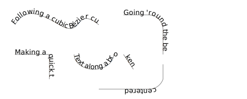


### Multi Line Text

This is a particular feature of drawsvg: A list of strings as input for Text()
is rendered as multi-line text.

```python
tl = ['this is', 'a', 'multiline text', 'given as a', 'list']
d.append(dw.Text(tl, 14, 50, 20, text_anchor='middle'))

ts = 'this is\na\nmultiline text\ngiven as a\nstring'
d.append(dw.Text(ts, 14, 150, 20, text_anchor='middle'))
```


### Fonts

Specify fonts via `font_family`.

```python
d.append(dw.Text('Some text in Times New Roman.', 30, 10, 35, font_family='Times New Roman'))
d.append(dw.Text('Some text in Arial Black.', 30, 10, 75, font_family='Arial Black'))
d.append(dw.Text('Some text in Georgia.', 30, 10, 115, font_family='Georgia'))
```

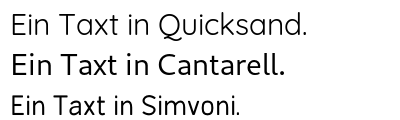

Specify a default font.

```python
d = dw.Drawing(600, 120, font_family='Times New Roman')
d.append(dw.Text('Some text in global setting (Times New Roman).', 30, 10, 35))
d.append(dw.Text('Some text in Arial Black.', 30, 10, 75, font_family='Arial Black'))
d.append(dw.Text('Some text in Georgia.', 30, 10, 115, font_family='Georgia'))
```

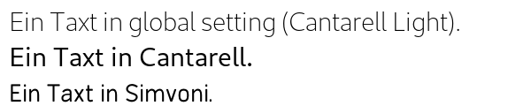


### Advanced Text Features

The text properties which are described in this section are currently (drawsvg 2.2.0)
not provieded by the internal rendering. The solution for now is to export an svg file
which is then rendered by inkscape.

#### White Space
White space is preserved with the `white__space='pre'` property. (See [W3C](https://www.w3.org/TR/css-text-3/#white-space-property) for all options.)

```python
d = dw.Drawing(300,100,id_prefix='whitespace')
d.append(dw.Text('white   space   not   preserved',14,30,30))
d.append(dw.Text('white   space   preserved',14,30,60,white_space='pre'))
d.save_svg('white-space.svg')
from os import system
system('inkscape -o 04_whitespace.png white-space.svg')
```

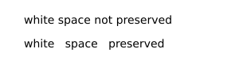


#### Wrapping Text: 'inline-size'

See [W3C](https://www.w3.org/TR/SVG/text.html#InlineSize) for details.

```python
d = dw.Drawing(300,100,id_prefix='inlinesize')
t = 'This text wraps at 200 pixels.'
x,y = 50,30
d.append(dw.Text(t,20,x,y,style='font-style: sans-serif; inline-size: 200px;'))
d.append(dw.Line(x,0,x,100,stroke='gray'))
d.append(dw.Line(x+200,0,x+200,100,stroke='gray'))
d.save_svg('inline-size.svg')
from os import system
system('inkscape -o 04_inlinesize.png inline-size.svg')
```

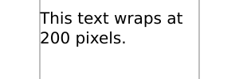


#### Text Inside a Shape 

See [W3C](https://www.w3.org/TR/SVG/text.html#TextShapeInside) for details.

```python
d = dw.Drawing(300,300,id_prefix='shapeinside')
t = 'Lorem ipsum dolor sit amet, consectetur adipisici elit, sed eiusmod tempor incidunt ut labore et dolore magna aliqua. Ut enim ad minim veniam, quis nostrud exercitation ullamco laboris nisi ut aliquid ex ea commodi consequat.'
x,y = 50,30
d.append(dw.Circle(150,150,120,stroke='gray',fill='none',id='wrap'))
d.append(dw.Text(t,20,0,0,style="""font-style: sans-serif;
                text-align: center;
                shape-inside: url(#wrap);"""))
d.save_svg('shape-inside.svg')
from os import system
system('inkscape -o 04_shapeinside.png shape-inside.svg')
```

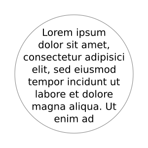


#### The 'shape-subtract' property

The result is here not completely according to [W3C](https://www.w3.org/TR/SVG2/text.html#TextShapeSubtract)
because the justification does not work, but the `shape-subtract` works.

```python
d = dw.Drawing(450,300,id_prefix='shapesubtract')
d.append(dw.Rectangle(25,25,225,175,fill='white',stroke='black',id='rect1'))
d.append(dw.Rectangle(200,125,225,150,fill='white',stroke='black',id='rect2',style="shape-margin:25px;"))
t = 'Lorem ipsum dolor sit amet, consectetur adipisici elit, sed eiusmod tempor incidunt ut labore et dolore magna aliqua. Ut enim ad minim veniam, quis nostrud exercitation ullamco laboris nisi ut aliquid ex ea commodi consequat.'
d.append(dw.Text(t,12,0,0,style="""shape-inside:url(#rect1); 
                                shape-subtract:url(#rect2); 
                                shape-padding:25px; 
                                font-family:DejaVu Sans; 
                                text-align:justified; 
                                line-height:110%"""))
d.append(dw.Text(t,12,0,0,style="""shape-inside:url(#rect2);
                            shape-padding:25px;
                            font-family:DejaVu Sans;
                            text-align:justified;
                            line-height:110%"""))
d.save_svg('shape-subtract.svg')
from os import system
system('inkscape -o 04_shapesubtract.png shape-subtract.svg')
d
```

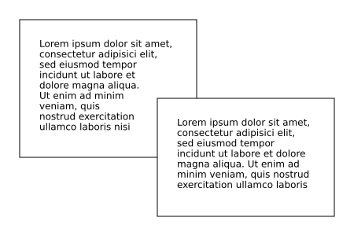

#### The 'shape-padding' property

Again the justification is not correct in the inkscape output but the padding works as expected.

```python
d = dw.Drawing(300,300,id_prefix='shapepadding')
d.append(dw.Circle(150,150,125,fill='none',stroke='black',id='circle'))
t = 'This is a sample of wrapped text in SVG 2! There should be 25 pixel padding around the text. The text is justified on both sides. It looks good!'
d.append(dw.Text(t,18,0,0,style='shape-inside: url(#circle); shape-padding: 25px; font-family: DejaVu Sans; text-align: justified; line-height: 110%;'))
d.save_svg('shape-padding.svg')
from os import system
system('inkscape -o 04_shapepadding.png shape-padding.svg')
d
```

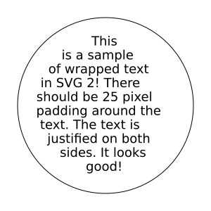


## Gradient, Clip, Mask

### Linear Gradient

```python
gradient = dw.LinearGradient(x1, y1, x2, y2, gradientUnits='userSpaceOnUse', **kwargs)
gradient.add_stop(offset, color, opacity=None)
```

```python
grad = dw.LinearGradient(150, 0, 0, 0)
grad.add_stop(0, 'green')
grad.add_stop(1, 'yellow')
d.append(dw.Rectangle(10, 10, 150, 60,
                      stroke='black', fill=grad))
```

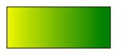


### Radial Gradient

```python
gradient = dw.RadialGradient(cx, cy, r, **kwargs)
gradient.add_stop(offset, color, opacity=None)
```

```python
gradient = dw.RadialGradient(200, 100, 100)
gradient.add_stop(0, 'green', 1)
gradient.add_stop(1, 'orange', 1)
bg = dw.Rectangle(x=0, y=0, width='100%', height='100%', fill=gradient)
d.append(bg)
```

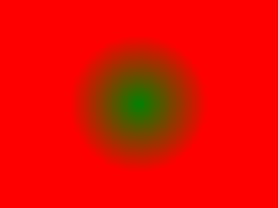


### Clip

```python
clip_name = dw.ClipPath()
```

To add shape as Clip, use `.append()` method.
To apply Clip, fill `clip_path` argument with `clip_name`.

```python
# Show both shapes as they are
d.append(dw.Rectangle(100, 100, 100, 100,
                      stroke='gray', fill='none'))
d.append(dw.Circle(100, 100, 100,
                   fill='none', stroke='gray', stroke_dasharray='5 5'))
# Apply rect as clip to circle
clip = dw.ClipPath()
clip.append(dw.Rectangle(100, 100, 100, 100))
d.append(dw.Circle(100, 100, 100,
                   fill='cyan', clip_path=clip))
```

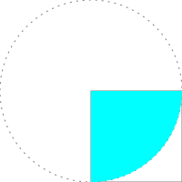

Another example:

```python
# Draw a random path in the left half of the canvas
p = dw.Path(stroke='black', stroke_width=2, fill='none')
p.M(150, 150)
import random
random.seed(1)
for i in range(40):
    p.L(random.randint(0, 300), random.randint(0, 200))
d.append(p)

# Circle as clipping shape
circ = dw.Circle(150, 100, 75)
c = dw.ClipPath()
c.append(circ)

# Repeat lines in the right half and apply clipping
d.append(dw.Use(p, 300, 0, clip_path=c))
```


Complex clip path:

```python
curve1 = dw.Path(stroke='black', stroke_width=1, stroke_dasharray='3 2', fill='none')
curve1.M(5, 55).C(25, 5, 45, -25, 75, 55).C(85, 85, 20, 105, 40, 55).Z()

curveClip = dw.ClipPath()
curveClip.append(dw.Use(curve1, 0, 0))

text1 = dw.Text('CLIP', 48, 20, 20, font_weight='bold', transform='rotate(60)',
                stroke='black', stroke_width=1, stroke_dasharray='3 2', fill='none')
textClip = dw.ClipPath()
textClip.append(dw.Use(text1, 0, 0))

shapes = dw.Group()
shapes.append(dw.Rectangle(0, 50, 90, 60, fill='#999'))
shapes.append(dw.Circle(25, 25, 25, fill='#666'))
shapes.append(dw.Lines(30, 0, 80, 0, 80, 100, close='true', fill='#ccc'))

# draw shapes with clip path
d.append(dw.Use(shapes, 0, 0, clip_path=curveClip))

# show clip path
g = dw.Group(transform='translate(100,0)')
g.append(shapes)
g.append(dw.Use(curve1, 0, 0))
d.append(g)

# draw shapes with text as clip path
d.append(dw.Use(shapes, 0, 150, clip_path=textClip))

# show text clip path
g = dw.Group(transform='translate(100,150)')
g.append(shapes)
g.append(dw.Use(text1, 0, 0))
d.append(g)
```


### Mask

```python
mask_name = dw.Mask()
```

The transparency of the masking object is transfered to the masked object.
Opaque pixels of the mask produce opaque pixels of the masked object.
Transparent parts of the mask make the corresponding parts of the masked object invisible.

```python
gradient = dw.LinearGradient(*[0,0], *[1,0], gradientUnits='objectBoundingBox')
gradient.add_stop(0, 'white')
gradient.add_stop(1, 'black')

mask = dw.Mask()
box = dw.Rectangle(30, 0, 100, 100, fill=gradient)
mask.append(box)

# Initial shape
rect = dw.Rectangle(0, 0, 200, 100,
                    fill='cyan', stroke='blue', stroke_width=2)
d.append(rect)

# After mask
rect = dw.Rectangle(0, 0, 200, 100,
                    fill='pink', stroke='red', stroke_width=2,
                    mask=mask)
d.append(rect)
```

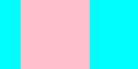

Mask using opaque colors:

```python
# Define the masks
redmask = dw.Mask(maskContentUnits='objectBoundingBox')
redmask.append(dw.Rectangle(0, 0, 1, 1, fill='#f00'))
greenmask = dw.Mask(maskContentUnits='objectBoundingBox')
greenmask.append(dw.Rectangle(0, 0, 1, 1, fill='#0f0'))
bluemask = dw.Mask(maskContentUnits='objectBoundingBox')
bluemask.append(dw.Rectangle(0, 0, 1, 1, fill='#00f'))
whitemask = dw.Mask(maskContentUnits='objectBoundingBox')
whitemask.append(dw.Rectangle(0, 0, 1, 1, fill='#fff'))

# Display the colors
d.append(dw.Rectangle(10, 10, 50, 50, fill='#f00'))
d.append(dw.Rectangle(70, 10, 50, 50, fill='#0f0'))
d.append(dw.Rectangle(130, 10, 50, 50, fill='#00f'))
d.append(dw.Rectangle(190, 10, 50, 50, fill='#fff', stroke='black'))

# Mask
g = dw.Group(mask=redmask)
g.append(dw.Circle(35,115,25,fill='black'))
g.append(dw.Text('Red',14,35,80,text_anchor='middle'))
d.append(g)
g = dw.Group(mask=greenmask)
g.append(dw.Circle(95, 115, 25, fill='black'))
g.append(dw.Text('Green', 14, 95, 80, text_anchor='middle'))
d.append(g)
g = dw.Group(mask=bluemask)
g.append(dw.Circle(155, 115, 25, fill='black'))
g.append(dw.Text('Blue', 14, 155, 80, text_anchor='middle'))
d.append(g)
g = dw.Group(mask=whitemask)
g.append(dw.Circle(215, 115, 25, fill='black'))
g.append(dw.Text('White', 14, 215, 80, text_anchor='middle'))
d.append(g)
```


Mask alpha using opacity only:

```python
fullmask = dw.Mask(maskContentUnits='objectBoundingBox')
fullmask.append(dw.Rectangle(0, 0, 1, 1, fill_opacity=1.0, fill='white'))
three_fourths = dw.Mask(maskContentUnits='objectBoundingBox')
three_fourths.append(dw.Rectangle(0, 0, 1, 1, fill_opacity=0.75, fill='white'))
one_half = dw.Mask(maskContentUnits='objectBoundingBox')
one_half.append(dw.Rectangle(0, 0, 1, 1, fill_opacity=0.5, fill='white'))
one_fourth = dw.Mask(maskContentUnits='objectBoundingBox')
one_fourth.append(dw.Rectangle(0, 0, 1, 1, fill_opacity=0.25, fill='white'))

g = dw.Group(mask=fullmask)
g.append(dw.Circle(35, 35, 25))
g.append(dw.Text('100%', 14, 35, 80, text_anchor='middle'))
d.append(g)
g = dw.Group(mask=three_fourths)
g.append(dw.Circle(95, 35, 25))
g.append(dw.Text('50%', 14, 95, 80, text_anchor='middle'))
d.append(g)
g = dw.Group(mask=one_half)
g.append(dw.Circle(155, 35, 25))
g.append(dw.Text('50%', 14, 155, 80, text_anchor='middle'))
d.append(g)
g = dw.Group(mask=one_fourth)
g.append(dw.Circle(215, 35, 25))
g.append(dw.Text('25%', 14, 215, 80, text_anchor='middle'))
d.append(g)
```


## Group, Use, Defs, Image

### Group

```python
dw.Group(**kwargs)
```

Any style specified in the g tag will apply to all child elements in the group.

```python
g_house = dw.Group(id='house', fill='none', stroke='black')
g_house.append(dw.Rectangle(6, 50, 60, 60))
g_house.append(dw.Lines(6, 50, 36, 9, 66, 50))
g_house.append(dw.Lines(36, 110, 36, 80, 50, 80, 50, 110))
d.append(g_house)

g_man = dw.Group(id='man', fill='none', stroke='blue')
g_man.append(dw.Circle(85, 56, 10))
g_man.append(dw.Line(85, 66, 85, 80))
g_man.append(dw.Lines(76, 104, 85, 80, 94, 104))
g_man.append(dw.Lines(76, 70, 85, 76, 94, 70))
d.append(g_man)

g_woman = dw.Group(id='woman', fill='none', stroke='red')
g_woman.append(dw.Circle(110, 56, 10))
g_woman.append(dw.Lines(110, 66, 110, 80, 100, 90, 120, 90, 110, 80))
g_woman.append(dw.Line(104, 104, 108, 90))
g_woman.append(dw.Line(112, 90, 116, 104))
g_woman.append(dw.Lines(101, 70, 110, 76, 119, 70))
d.append(g_woman)
```


### Use

```python
dw.Use(other_elem, x, y, **kwargs)
```

```python
g_house = dw.Group(id='house', fill='none', stroke='black')
g_house.append(dw.Rectangle(6, 50, 60, 60))
g_house.append(dw.Lines(6, 50, 36, 9, 66, 50))
g_house.append(dw.Lines(36, 110, 36, 80, 50, 80, 50, 110))
d.append(g_house)

# Use id which is set
d.append(dw.Use('house', 100, 50))
# Or use variable name
d.append(dw.Use(g_house, 150, 20))
```


### Defs

Elements that are not appended to the drawing but are referenced by other elements will automatically be included in `<defs></defs>`.
([source](https://github.com/cduck/drawsvg/issues/46))

```python
d = dw.Drawing(200, 200, id_prefix='defs')

# Do not append `bond` to the drawing
bond = dw.Line(0, 0, 10, 10, stroke='black')

# `bond` is automatically added into <defs>
# A default `id` is generated if one isn't set
d.append(dw.Use(bond, 20, 50))
d.append(dw.Use(bond, 50, 50))
d.append(dw.Use(bond, 80, 50))

print(d.as_svg())
```

Output:

```svg
<?xml version="1.0" encoding="UTF-8"?>
<svg xmlns="http://www.w3.org/2000/svg" xmlns:xlink="http://www.w3.org/1999/xlink"
     width="200" height="200" viewBox="0 0 200 200">
<defs>
<path d="M0,0 L10,10" stroke="black" id="defs0" />
</defs>
<use xlink:href="#defs0" x="20" y="50" />
<use xlink:href="#defs0" x="50" y="50" />
<use xlink:href="#defs0" x="80" y="50" />
</svg>
```


### Image

```python
dw.Image(x, y, width, height, path=None, data=None,
         embed=False, mimeType=None, **kwargs)
```

```python
d.append(dw.Image(0, 0, 200, 200, 'example1.png', embed=True))
```

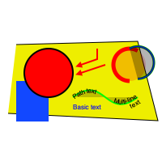


## Transformations

### Translate

```python
transform = 'translate(x,y)'
```

This attribute can be added to many objects. Simple example:

```python
d.append(dw.Rectangle(0, 0, 40, 40))
d.append(dw.Rectangle(0, 0, 40, 40, fill='red', transform='translate(50,50)'))
```

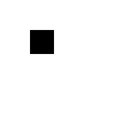


### Scale

```python
transform = 'scale(x_mult[, y_mult])'
```

Note that scaling also affects stroke width.

```python
square = dw.Rectangle(0, 0, 40, 40, fill='none', stroke_width=2)
d.append(dw.Use(square, 10, 10, stroke='black'))
d.append(dw.Use(square, 10, 10, stroke='red', transform='scale(2)'))
```

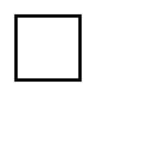

It is possible to specify x and y scale separately:

```python
square = dw.Rectangle(0, 0, 40, 40, fill='none', stroke_width=2)
d.append(dw.Use(square, 10, 10, stroke='black'))
d.append(dw.Use(square, 10, 10, stroke='red', transform='scale(3,1.5)'))
```

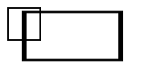

Scaling around a center point:

```python
# Center of scaling: (100, 100)
d.append(dw.Circle(100, 100, 4, fill='black'))
# Non-scaled rectangle
rect = dw.Rectangle(70, 80, 60, 40, stroke='black', fill='none')
d.append(rect)
# Scaled rectangles
d.append(dw.Use(rect, 0, 0, transform='translate(-100,-100) scale(2)', stroke_width=0.5))
d.append(dw.Use(rect, 0, 0, transform='translate(-150,-150) scale(2.5)', stroke_width=0.4))
d.append(dw.Use(rect, 0, 0, transform='translate(-200,-200) scale(3)', stroke_width=0.33))
```

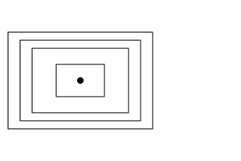


### Rotate

```python
transform = 'rotate(angle,cx=0,cy=0)'
```

`angle` counts clockwise in degrees.
`cx`/`cy` are the center of rotation.

```python
# Show frame border
d.append(dw.Rectangle(0, 0, 200, 200, stroke='gray', fill='none'))
# Rotation is around (0, 0)
d.append(dw.Rectangle(70, 30, 40, 40, fill='silver'))
d.append(dw.Rectangle(70, 30, 40, 40, fill='gray', transform='rotate(22.5)'))
d.append(dw.Rectangle(70, 30, 40, 40, fill='black', transform='rotate(45)'))
```

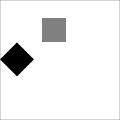

```python
# Center of rotation
d.append(dw.Circle(100, 100, 3, fill='black'))
# Non-rotated arrow
arrow = dw.Group(id='arrow')
arrow.append(dw.Line(110, 100, 160, 100))
arrow.append(dw.Lines(160, 100, 155, 95, 155, 105))
d.append(dw.Use(arrow, 0, 0, stroke='black', fill='black'))
# Rotated arrows
g = dw.Group(stroke='red', fill='red')
g.append(dw.Use(arrow, 0, 0, transform='rotate (60,100,100)'))
g.append(dw.Use(arrow, 0, 0, transform='rotate (-90,100,100)'))
g.append(dw.Use(arrow, 0, 0, transform='rotate (-150,100,100)'))
d.append(g)
```

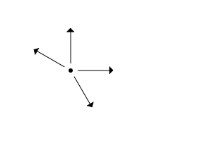


### Skew

```python
transform = 'skewX(angle)'
transform = 'skewY(angle)'
```

```python
g = dw.Group(stroke='gray', stroke_dasharray='4 4')
g.append(dw.Line(0, 0, 200, 0))
g.append(dw.Line(20, 0, 20, 90))
g.append(dw.Line(120, 0, 120, 90))
d.append(g)

h = dw.Group(transform='translate(20,0)')
h1 = dw.Group(transform='skewX(30)')
h1.append(dw.Lines(50, 0, 0, 0, 0, 50,
                   stroke='black', fill='none', stroke_width=2))
h1.append(dw.Text('skewX', 16, 0, 60))
h.append(h1)
d.append(h)

i = dw.Group(transform='translate(120,0)')
i1 = dw.Group(transform='skewY(30)')
i1.append(dw.Lines(50, 0, 0, 0, 0, 50,
                   stroke='black', fill='none', stroke_width=2))
i1.append(dw.Text('skewY', 16, 0, 60))
i.append(i1)
d.append(i)
```

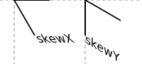


### Cartesian Coordinates

A drawing which can be translated to Cartesian coordinates
(where y-coordinates increase upward, not downward)
by setting the translate-y value to the drawing's height, and also applying `scale(1,-1)`.

Trapezoid with origin to top left (the default):

```python
d.append(dw.Lines(0, 100, 0, 0, 100, 0,
                  fill='none', stroke='green', stroke_width=2))
d.append(dw.Lines(40, 40, 100, 40, 70, 70, 40, 70,
                  fill='silver', stroke='black', stroke_width=2))
d.append(dw.Text('downward y', 12, 5, 95))
```

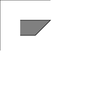

Translated origin to bottom left and upward-y:

```python
g = dw.Group(transform='translate(0,100) scale(1,-1)')
g.append(dw.Lines(0, 100, 0, 0, 100, 0,
                  fill='none', stroke='green', stroke_width=2))
g.append(dw.Lines(40, 40, 100, 40, 70, 70, 40, 70,
                  fill='silver', stroke='black', stroke_width=2))
g.append(dw.Text('upward y', 12, 5, 95))
d.append(g)
```

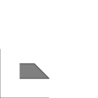

Alternatively, apply `scale(1,-1)` to the whole drawing:

```python
d = dw.Drawing(100, 100, id_prefix='cart3', transform='scale(1,-1)')
d.append(dw.Lines(0, 100, 0, 0, 100, 0,
                  fill='none', stroke='green', stroke_width=2))
d.append(dw.Lines(40, 40, 100, 40, 70, 70, 40, 70,
                  fill='silver', stroke='black', stroke_width=2))
d.append(dw.Text('upward y', 12, 5, 95))
```

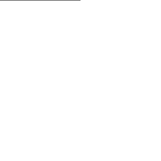


## Credits

Written by joachim heintz 2023.  Edited by Casey Duckering.

Most examples are based on J. David Eisenberg, SVG Essentials, O'Reilly 2002.

Thanks to [Ahmad Aufar Husaini](https://github.com/aufarah) for his fork (draw2Svg) and for providing some documentation [here](https://draw2svg.netlify.app/) (some examples are used in this Quick Reference).

Thanks to [Casey Duckering](https://github.com/cduck) for drawsvg and many helpful explanations on its [discussion page](https://github.com/cduck/drawsvg/discussions).
